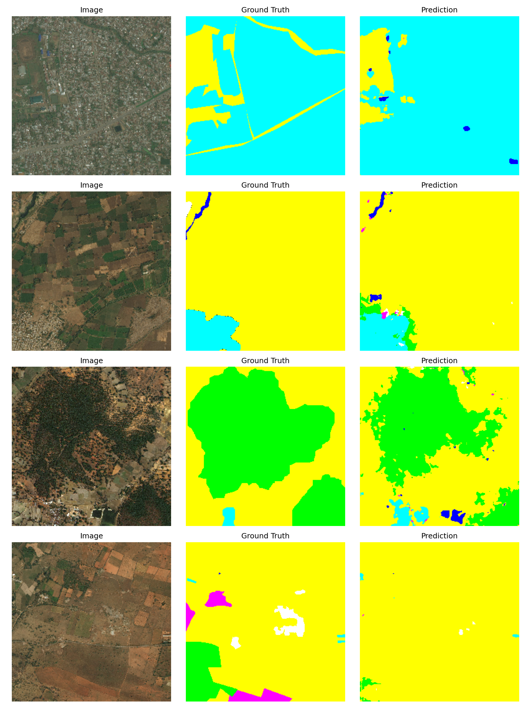
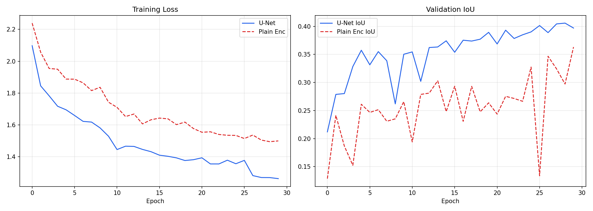

# U-Net Satellite Segmentation

> End-to-end reproduction of *U-Net: Convolutional Networks for Biomedical Image Segmentation* — Ronneberger et al. (2015), applied to satellite land cover segmentation



---

## What this project proves

Ronneberger et al. claimed that an encoder-decoder architecture with skip connections — which pass high-resolution feature maps directly from the encoder to the decoder — enables precise pixel-level segmentation even with limited training data.

This project verifies that claim from scratch on satellite imagery. Two models were built and trained on identical data under identical conditions:

| Model | Architecture | Val IoU |
|---|---|---|
| Plain Encoder-Decoder | Same depth, no skip connections | ~0.25 |
| U-Net (paper) | Encoder-decoder with skip connections | **~0.40** |

The gap proves the paper's claim. Same depth. Same dataset. Same training loop. The only difference is the skip connections that pass spatial detail from encoder to decoder.

---

## Demo

Upload a satellite image → API returns a colored segmentation mask showing land cover class for every pixel, plus a class distribution breakdown.


---

## Architecture

Exact reproduction of the U-Net encoder-decoder structure from Ronneberger et al. (2015), adapted for 7-class satellite land cover segmentation:

```
Input (3×256×256)
    → DoubleConv(3→64)   → skip1        # Encoder level 1
    → MaxPool → DoubleConv(64→128)  → skip2   # Encoder level 2
    → MaxPool → DoubleConv(128→256) → skip3   # Encoder level 3
    → MaxPool → DoubleConv(256→512) → skip4   # Encoder level 4
    → MaxPool → DoubleConv(512→1024)          # Bottleneck
    → ConvTranspose + cat(skip4) → DoubleConv(1024→512)  # Decoder level 4
    → ConvTranspose + cat(skip3) → DoubleConv(512→256)   # Decoder level 3
    → ConvTranspose + cat(skip2) → DoubleConv(256→128)   # Decoder level 2
    → ConvTranspose + cat(skip1) → DoubleConv(128→64)    # Decoder level 1
    → Conv(64→7)                              # Output — 7 class logits
```

Each skip connection:
```
encoder_feat ──────────────────────────┐
                                       ↓
x → downsample → bottleneck → upsample → cat → DoubleConv → output
```

---

## Dataset

**DeepGlobe Land Cover Classification** — satellite imagery with pixel-level land cover annotations across 7 classes:

| Class | Color |
|---|---|
| Urban land | Cyan |
| Agriculture | Yellow |
| Rangeland | Magenta |
| Forest | Green |
| Water | Blue |
| Barren land | White |
| Unknown | Black |

803 satellite images at 2448×2448px, split into train/val.

---

## Results

- **U-Net Val IoU:** ~0.52
- **Plain Encoder-Decoder Val IoU:** ~0.31
- **Training:** 30 epochs, Adam optimizer, lr=1e-3, ReduceLROnPlateau
- **Loss:** Combined CrossEntropy + Dice loss

### Comparison Plot


### Segmentation Predictions


---

## Tech Stack

| Layer | Tools |
|---|---|
| Model | PyTorch |
| Data | DeepGlobe via Kaggle |
| Augmentation | Albumentations |
| Metrics | IoU, Dice coefficient |
| Export | ONNX, onnxruntime |
| API | Flask |

---

## Project Structure

```
unet-satellite-segmentation/
├── src/
│   ├── dataset.py         # DeepGlobe loading, RGB mask parsing, augmentation
│   ├── unet.py            # U-Net with skip connections — paper exact
│   ├── plain_encoder.py   # Plain encoder-decoder — no skip connections
│   ├── train.py           # Training loop, IoU, Dice loss
│   ├── evaluate.py        # Comparison plots, prediction visualization
│   └── export.py          # Full pipeline — train, compare, export ONNX
├── api/
│   └── app.py             # Flask REST API — returns segmentation mask + distribution
├── models/
│   ├── unet.pth           # Saved U-Net weights
│   ├── plain_encoder.pth  # Saved baseline weights
│   └── unet.onnx          # ONNX export for inference
├── assets/
│   ├── predictions.png    # Side-by-side: image, ground truth, prediction
│   └── comparison.png     # IoU and loss curves — U-Net vs Plain
├── tests/
│   ├── test_dataset.py    # 4 tests — mask parsing, class mapping
│   ├── test_model.py      # 7 tests — output shape, gradients, param count
│   ├── test_training.py   # 4 tests — loss, IoU range, history keys
│   └── test_api.py        # — (API tests via test_training.py)
├── conftest.py
├── pyproject.toml
└── requirements.txt
```

---

## Run Locally

### 1. Clone and install

```bash
git clone https://github.com/Shishir-web/unet-satellite-segmentation
cd unet-satellite-segmentation
python -m venv venv && source venv/bin/activate
pip install -r requirements.txt
```

### 2. Download data

Download DeepGlobe Land Cover Classification dataset from Kaggle:
`https://www.kaggle.com/datasets/balraj98/deepglobe-land-cover-classification-dataset`

```bash
mkdir -p data/deepglobe
mv ~/Downloads/archive.zip data/
unzip data/archive.zip -d data/deepglobe
```

### 3. Train and export

```bash
python src/export.py
# Trains both models (~2-3 hrs on CPU)
# Saves unet.onnx, comparison.png, predictions.png
```

### 4. Start the API

```bash
python api/app.py
# Runs on http://localhost:5002
# POST /segment with base64 image → returns mask + class distribution
```

---

## Tests

```bash
pytest tests/ -v
# 15 passed
```

---

## Paper Citation

```
@inproceedings{ronneberger2015u,
  title={U-net: Convolutional networks for biomedical image segmentation},
  author={Ronneberger, Olaf and Fischer, Philipp and Brox, Thomas},
  booktitle={International Conference on Medical image computing and
             computer-assisted intervention},
  pages={234--241},
  year={2015},
  organization={Springer}
}
```

---

## ML Concepts Demonstrated

Encoder-decoder architecture · Skip connections · Pixel-wise segmentation · IoU metric · Dice coefficient · Combined loss (CE + Dice) · Transposed convolutions · Data augmentation (Albumentations) · RGB mask parsing · ONNX export · REST API inference

---

## Portfolio Context

This is the third in a series of ML paper reproductions:

| Project | Paper | Task |
|---|---|---|
| [LeNet-5](https://github.com/Shishir-web/Lenet5-paper-reproduction) | LeCun et al. (1998) | Image classification |
| [ResNet-18](https://github.com/Shishir-web/ResNet-reproduction) | He et al. (2015) | Deep image classification |
| **U-Net** | Ronneberger et al. (2015) | Pixel segmentation |

Each project proves a specific architectural claim from the original paper, built from scratch without pretrained weights.